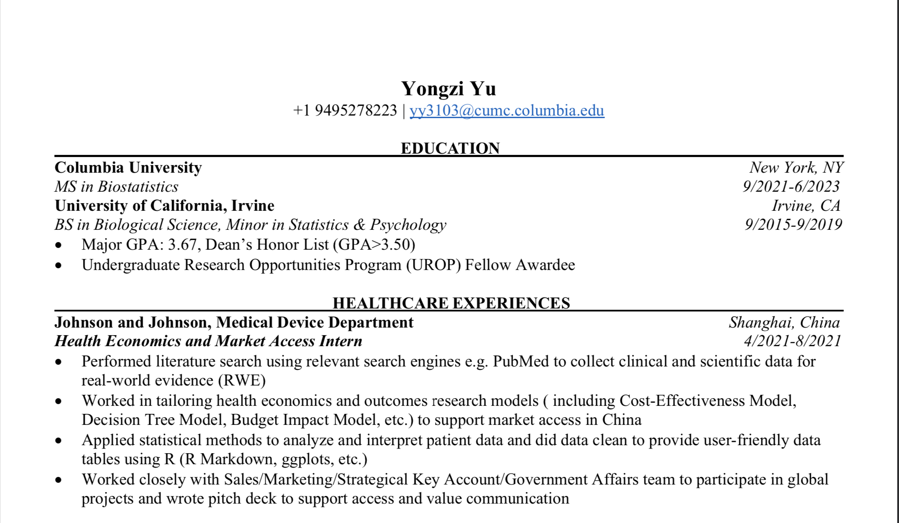
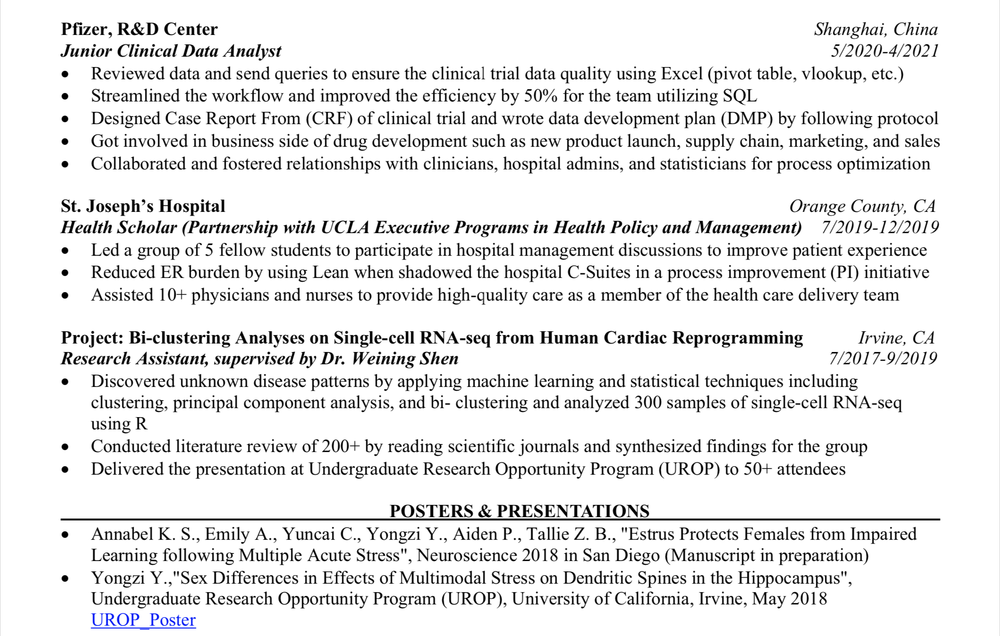
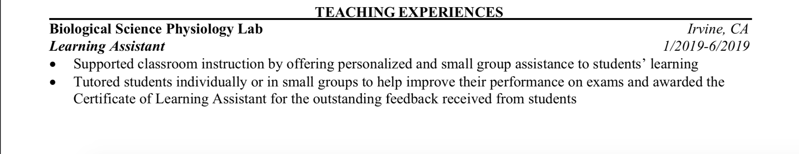

Hi, My name is Yongzi. This website is about my resume.

Here's back to the [index](index.html) page
here is [resume](about.html) page.
Here he is:

# Education
Columbia University
MS in Biostatistics

University of California, Irvine

# Working Experience
Johnson and Johnson, Medical Device Department
Health Economic and Market Access Intern  
-  Performed literature search using relevant search engines e.g. PubMed to collect clinical and scientific data for real-world evidence (RWE)  
-  Worked in tailoring health economics and outcomes research models ( including Cost-Effectiveness Model, Decision Tree Model, Budget Impact Model, etc.) to support market access in China  
-  Applied statistical methods to analyze and interpret patient data and did data clean to provide user-friendly data tables using R (R Markdown, ggplots, etc.)  
-  Worked closely with Sales/Marketing/Strategical Key Account/Government Affairs team to participate in global projects and wrote pitch deck to support access and value communication  

